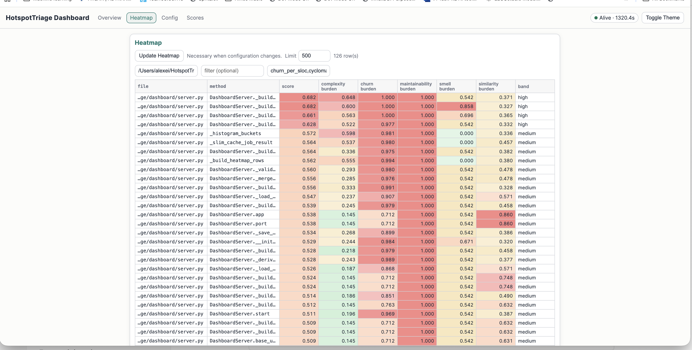

# HotspotTriage

[](LICENSE) [](pyproject.toml) [](https://github.com/avnovikov/HotspotTriage/actions/workflows/security.yml) [](https://github.com/avnovikov/HotspotTriage/actions/workflows/tests.yml) [](CONTRIBUTING.md#13-ssh-commit-and-tag-signing-required) [](docs/Compliance.md)

> This codebase is built to be part of the regulated and audited system scope. See [Compliance](docs/Compliance.md).

Find where Python code gets messy and constantly changing — then stream that signal to supercharge your coding agent.

HotspotTriage analyzes tracked `.py` files in a Git repo, blends AST metrics (Radon) with history (`git log`), per-function churn (in block mode), smells (Pylint heuristics), and block similarity (DeepCSIM) — all wired through MCP for integration with agents.

Designed for engineers and coding agents who want precise, actionable metrics to improve coding style, accelerate refactoring, and boost code quality.

Open source (MIT). Python 3.11+.


## The Problem

Even with real breakthroughs like Claude Opus 4.5 and GPT‑5.3‑Codex — frontier models that pushed agentic coding, planning, and code quality forward in late 2025 and early 2026 — the core problems remain:

Coding agents fall short: they regularly introduce duplicated, hard-to-maintain, and smell-prone code into real codebases, even when it passes basic tests.

Running only the most expensive models on every change wastes tokens and slows teams down, without guaranteeing better engineering outcomes.

Human reviewers cannot keep up with every diff in fast-moving repositories, so quality issues still slip through. And even top-tier models are not yet reliable, end‑to‑end code reviewers: they lack full architectural context, can misinterpret nuanced requirements, and often miss performance, maintainability, and security concerns that still require static analysis and focused human review.

We need a mechanism to automatically identify code problems and route refactoring and expensive models to relevant areas, not everywhere.

## 💡 The Solution

HotspotTriage makes the overlap visible per file or function, so you can prioritize reviews, make safer edits, and use stronger models where risk is highest. Coding agents can automatically determine which model to use, whether code should be refactored before changes, whether changes improved the code, and whether they were worth it. After a few iterations, your coding agents will start paying attention to the numbers, and over time, general code quality will improve automagically.

HotspotTriage's composite score isn't fixed — it's fully customizable through normalization coefficients that let you dial in what matters most right now. Want to prioritize code smells over raw complexity? Crank up the Pylint heuristics weight. Obsessed with duplication? Boost DeepCSIM's block similarity factor. As your team's priorities shift — maybe code smells during cleanup season, or churn during a big refactor — you simply adjust the sliders in the config, and your agents adapt instantly.

This puts engineers in control: the metric evolves alongside your codebase's real pain points, ensuring agents focus on where humans see the biggest risks — whether that's eliminating duplication patterns, taming cyclomatic complexity spikes, or catching maintainability red flags before they spread.

---



*The FastAPI UI (starts with `hotspottriage start-mcp-server --open-browser`): tool activity, logs, cache controls, and project context. This is a real screenshot of the running dashboard (not a mock). *

## Key Benefits

- **MCP server**: expose analysis, cache lifecycle, and config scaffolding to Cursor, Claude Code, and other MCP clients (FastMCP).
- **CLI**: table, JSON, or CSV output for CI and local exploration (`hotspottriage <repo>`).
- **Block mode**: function/method rows with cached churn (`git log -L`), optional similarity, and interpretable risk bands for agent routing.
- **Layered YAML config**: global, project, and local overrides (Serena-inspired layering); `hotspottriage init` scaffolds templates.

## Quick Start

**Python version:** HotspotTriage requires **Python 3.11, 3.12, or 3.13** (`requires-python` matches **deepcsim** on PyPI). On **3.14+**, pip reports `No matching distribution found for deepcsim` — use a supported interpreter (the install script checks this early).

**Install from a clone** (recommended — handles version check, `pip` upgrade, editable install):

```bash
git clone https://github.com/avnovikov/HotspotTriage.git
cd HotspotTriage
./scripts/install_hotspottriage.sh --venv
```

- **`--venv`** — create/use `.venv` under the repo (recommended).
- **`--uv`** — run `uv sync` instead of pip (requires [`uv`](https://docs.astral.sh/uv/) and `uv.lock`).
- **`--python /path/to/python3.13`** — pick an interpreter if `python3` on `PATH` is too new.

Manual equivalents:

```bash
uv sync
```

```bash
python3.13 -m venv .venv && .venv/bin/python -m pip install --upgrade pip && .venv/bin/python -m pip install -e .
```

Editable install with pip (only when the active interpreter is already 3.11–3.13):

```bash
pip install -e .
```

After install, `hotspottriage`, `hotspottriage-mcp`, and `hotspottriage-cache` are on your `PATH` when the active environment is the venv (or your chosen Python environment).

**Run as an MCP Server**

HotspotTriage exposes an MCP server over stdio. The `hotspottriage-mcp` command is just an alias for starting that server. The same process can also launch the local FastAPI dashboard for logs, cache actions, and block metrics.

Use `--open-browser` to open the dashboard when the server starts, `--no-dashboard` to disable it, and `--dashboard-port` / `--dashboard-host` to control where it binds. Use **`--default-target PATH_OR_URL`** to set the repo HotspotTriage should analyze when MCP tools omit `target` or pass an empty string. That default applies to `analyze`, `generate_cache`, `cache_status`, `clear_cache`, and project-scoped `init_config`. See [ARCHITECTRE.md](ARCHITECTRE.md) for dashboard internals.
```bash
uv run hotspottriage start-mcp-server --help
```
One-off run from Git (useful when you do not want a local editable install):
```bash
uvx -p 3.13 --from git+https://github.com/avnovikov/HotspotTriage hotspottriage start-mcp-server --open-browser --default-target /absolute/path/to/your/git/repo
```

Arguments after `start-mcp-server` are handled by HotspotTriage first (`--open-browser`, `--default-target`, dashboard flags), then any remaining arguments are passed through to the MCP runtime.

**Use with Cursor**

Below is example of the **Cursor** config (save as `.cursor/mcp.json` in the workspace you opened, or merge it into Cursor's MCP settings). The paths below are placeholders. When you use **`scripts/run_hotspottriage_mcp.sh`**, put only dashboard and default-target flags in **`args`** because the script already launches `hotspottriage start-mcp-server`.

```json
{
  "mcpServers": {
    "hotspottriage": {
      "command": "path/to/HotspotTriage/scripts/run_hotspottriage_mcp.sh",
      "args": ["--open-browser", "--default-target", "${workspaceFolder}"]
    }
  }
}
```

In Cursor `mcp.json`, you can often use `${workspaceFolder}` instead of an absolute path.

**PATH / `git`:** Cursor often starts MCP with a minimal `PATH`, which can cause `[Errno 2] No such file or directory: 'git'`. The launcher script prepends `.venv/bin` and common system directories (`/usr/bin`, `/bin`, `/usr/local/bin`, `/opt/homebrew/bin`). Prefer **omitting** the `env` block unless you need it. If you do set `PATH` yourself, Cursor may **not** expand `$PATH`, so provide the full value explicitly with your venv first.

**Use with Claude Code**

**Claude Code** discovers the server through its standard MCP config. From inside the cloned repo (so the launcher and venv resolve correctly):
```bash
claude mcp add hotspottriage -- ./scripts/run_hotspottriage_mcp.sh --open-browser --default-target /absolute/path/to/your/git/repo
```
Or register it manually by adding the same JSON as above to `~/.claude.json` under `mcpServers` (same shape as Cursor's MCP config). Then in a Claude Code session:

```text
/mcp                                    # confirm "hotspottriage" is connected
> Use hotspottriage analyze on this repo, top 15 by score   # omit target if server used --default-target for this repo
> Then call generate_cache so the dashboard heatmap is populated
```


Optional explicit `PATH` (only if you need it; replace placeholders with absolute paths on your machine):

```json
{
  "mcpServers": {
    "hotspottriage": {
      "command": "path/to/HotspotTriage/scripts/run_hotspottriage_mcp.sh",
      "args": ["--open-browser", "--default-target", "/absolute/path/to/your/git/repo"],
      "env": {
        "PATH": "/path/to/HotspotTriage/.venv/bin:/usr/bin:/bin:/usr/local/bin:/opt/homebrew/bin"
      }
    }
  }
}
```
Direct **`hotspottriage` binary** configuration (put `start-mcp-server` in **`args`**). This is the safest option if shell wrappers do not work correctly on your MCP host. Make sure **`git`** is on `PATH`; see **PATH / `git`** above, and do not rely on `$PATH` expansion inside JSON unless your client explicitly supports it.

```json
{
  "mcpServers": {
    "hotspottriage": {
      "command": "path/to/HotspotTriage/.venv/bin/hotspottriage",
      "args": ["start-mcp-server", "--open-browser", "--default-target", "/absolute/path/to/your/git/repo"],
      "env": {
        "PATH": "/path/to/HotspotTriage/.venv/bin:/usr/bin:/bin:/usr/local/bin:/opt/homebrew/bin"
      }
    }
  }
}
```
For reliable tooling resolution, use a dedicated virtual environment and keep that `bin` directory first on `PATH`. [`scripts/run_hotspottriage_mcp.sh`](scripts/run_hotspottriage_mcp.sh) is POSIX `sh`, not `bash`. It resolves the HotspotTriage checkout from the script location, prepends `.venv/bin` and common system directories to `PATH`, and then **`exec`s `hotspottriage start-mcp-server`**. If your MCP host cannot run shell scripts, point **`command`** at `.venv/bin/hotspottriage` and move `start-mcp-server` plus the same flags into **`args`**.

**Tools exposed over MCP:** `analyze`, `generate_cache`, `cache_status`, `clear_cache`, and `init_config`. Default `analyze` rows are **compact** (`function`, `score`, `risk_band`, `proposed_model`, `score_driver`, and a short **`rationale`** string). Pass `compact=false` when you need full metrics, `score_explanation`, and multi-line `score_narrative`. If the server was started with **`--default-target`**, tools can omit **`target`** when they should always operate on that repo.


Tips:

- With **`--default-target`**, `analyze` / `generate_cache` / `cache_status` / `clear_cache` can use an empty **`target`** for that repo.
- The first `analyze` call on a large repo populates `<repo>/.hotspottriage/cache/blocks.pkl`; subsequent calls are instant. Run `generate_cache` once up front to warm it deliberately.
- Project-level `.hotspottriage/project.yml` is **not** read by the MCP server (only by the CLI). Pass overrides as tool arguments, or change them via the dashboard config view.
- For your own projects, drop a `CLAUDE.md` at the repo root pointing at the modules you care about; Claude Code auto-loads it as system context.

**Make it a standing rule for agents:** Add the workflow from [`docs/agent-hotspottriage-score-check.md`](docs/agent-hotspottriage-score-check.md) to your repo's **`CLAUDE.md`**, Cursor **Rules**, Copilot instructions, or any agent playbook—so assistants **run MCP `analyze` on the target block before editing** and record score, band, and (when needed) subscores / proposed model.

---

## Learn More

| Doc | What's inside |
|-----|----------------|
| [ARCHITECTRE.md](ARCHITECTRE.md) | Pipeline, caching, dashboard, MCP wiring, module map |
| [SCORES.md](SCORES.md) | Metrics, normalization, composite score, risk bands |
| [docs/block-cache-model.md](docs/block-cache-model.md) | Block cache format and semantics |
| [docs/agent-hotspottriage-score-check.md](docs/agent-hotspottriage-score-check.md) | MCP score check before editing hotspots (agent workflow) |
| [CONTRIBUTING.md](CONTRIBUTING.md#13-ssh-commit-and-tag-signing-required) | SSH-signed commits and tags setup (one-time workstation config) |
| [SUPPORT.md](SUPPORT.md) | Support policy, supported versions, EOL process (UK PSTI / EU CRA) |
| [SECURITY.md](SECURITY.md) | Security policy, VDP, regulatory cross-reference mapping |
| [docs/Compliance.md](docs/Compliance.md) | Full compliance posture: SOC2, NIST, ISO 27001, EU CRA, GDPR |

Developing this repo: **`./scripts/install_hotspottriage.sh --venv`** (or **`uv sync`**); run **`uv lock`** after dependency changes in `pyproject.toml`. Run **`pytest`** (or `uv run pytest`) before merging; architecture notes live in [ARCHITECTRE.md](ARCHITECTRE.md) above.
